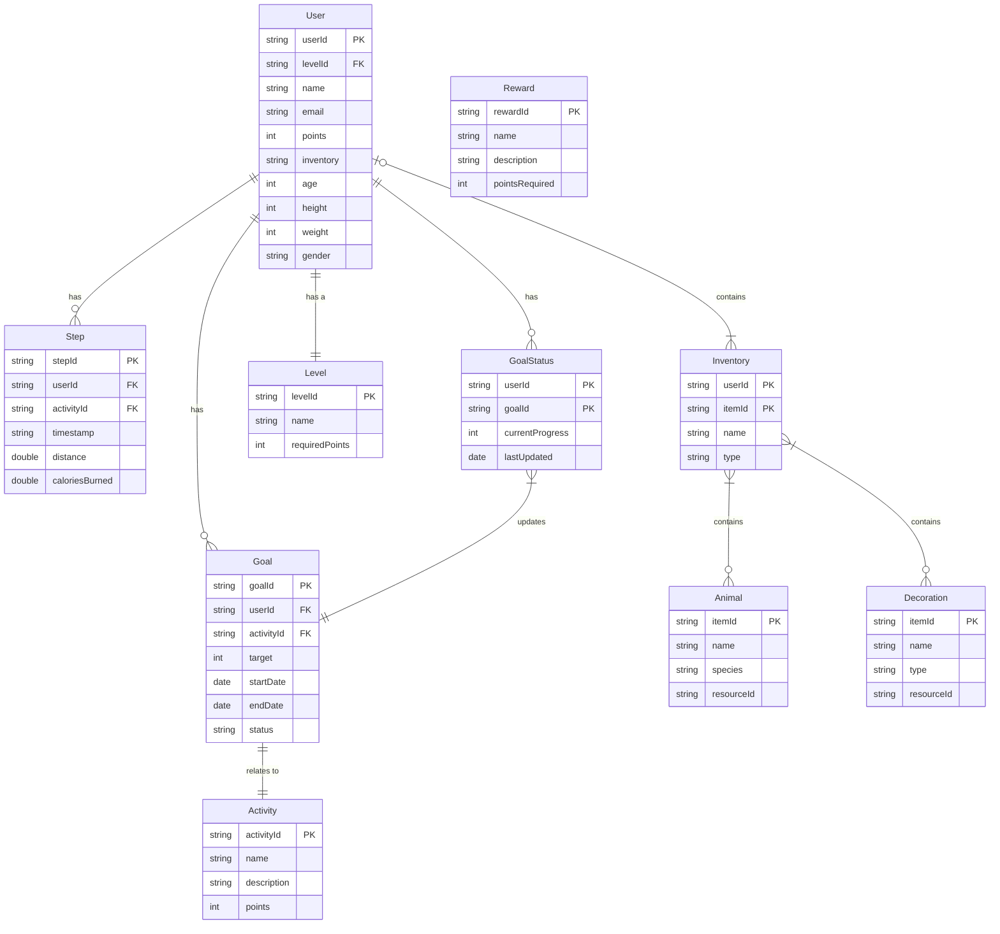

# Database schema

## Entity-Relationship Diagram

```mermaid
erDiagram
    User {
        string userId PK
        string levelId FK
        string name
        string email
        int points
        string inventory
        int age
        int height
        int weight
        string gender
    }

    Activity {
        string activityId PK
        string name
        string description
        int points
    }

    Step {
        string stepId PK
        string userId FK
        string activityId FK
        string timestamp
        double distance
        double caloriesBurned
    }

    Goal {
        string goalId PK
        string userId FK
        string activityId FK
        int target
        date startDate
        date endDate
        string status
    }

    GoalStatus {
        string userId PK
        string goalId PK
        int currentProgress
        date lastUpdated
    }

    Level {
        string levelId PK
        string name
        int requiredPoints
    }

    Inventory {
        string userId PK
        string itemId PK
        string name
        string type
    }

    Animal {
        string itemId PK
        string name
        string species
        string resourceId
    }

    Decoration {
        string itemId PK
        string name
        string type
        string resourceId
    }

    Reward {
        string rewardId PK
        string name
        string description
        int pointsRequired
    }

    User ||--o{ Goal : "has"
    User ||--o{ GoalStatus : "has"
    Goal ||--|| Activity : "relates to"
    User ||--|| Level : "has a"
    User |o--|{ Inventory : "contains"
    GoalStatus }|--|| Goal : "updates"
    User ||--o{ Step : "has"
    Inventory }|--o{ Animal : "contains"
    Inventory }|--o{ Decoration : "contains"
```
